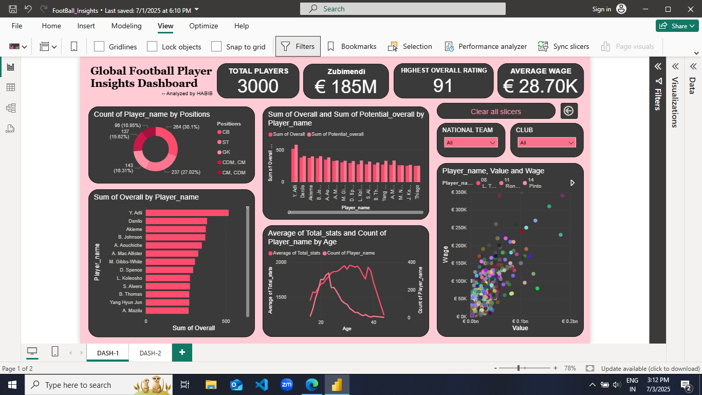
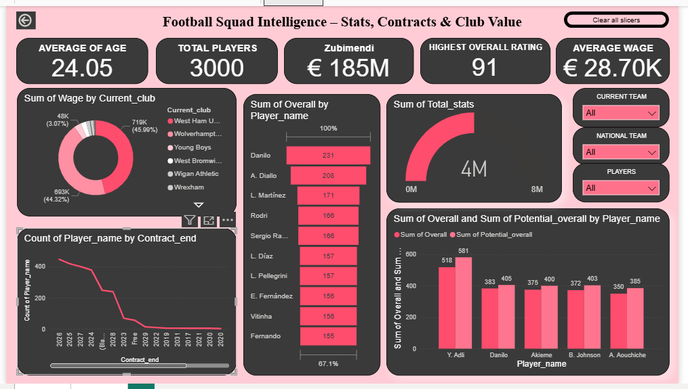

# ⚽ Football Insights Dashboard - Power BI

This project presents two interactive dashboards built using **Power BI**, providing key insights into football team and player performances. The dashboards were designed with a focus on data validation, slicers for dynamic filtering, and clean visual storytelling.

---

## 📌 Features

- ✅ Clean and interactive Power BI dashboards
- 🧹 Data validation and transformation using Power Query
- 📆 Dynamic slicers for flexible analysis
- 📊 Multiple visualizations including bar charts, pie charts, KPI cards, and tables
- 📂 Multi-page dashboard experience (2 dashboards)
- 🎯 Easy-to-use filters by country, team, or player
- 🧠 Insightful analytics built for better decision-making

---

## 📷 Dashboard Preview

### 1️⃣ Overview Dashboard


### 2️⃣ Player/Team Performance Dashboard


---

## 🛠️ Tools Used

| Tool        | Purpose                          |
|-------------|----------------------------------|
| Power BI    | Dashboard creation and interactivity |
| Power Query | Data cleaning and transformation |
| Excel       | Initial data handling (optional) |

---

## 🧠 Learnings & Highlights

- Understood the process of preparing clean, validated data for visualizations.
- Implemented dynamic **slicers** to enhance user control.
- Learned how to apply **custom measures and DAX expressions** for insightful KPIs.
- Improved visual design skills by maintaining consistency across dashboard pages.

---

## 📁 File Structure

```bash
FootBall_Insights.pbix       # Power BI file
Dashboard1/Dashboard2        # Contains dashboard images
README.md                    # This file
